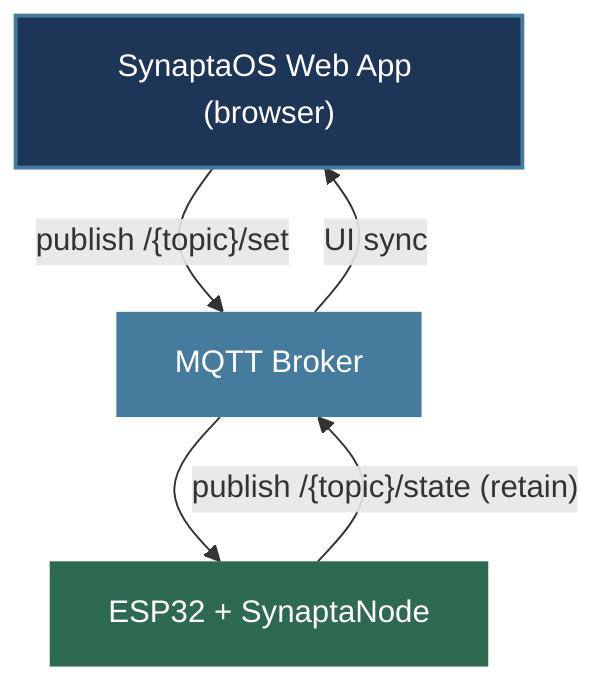

# SynaptaNode

ESP32 Arduino library สำหรับระบบ [SynaptaOS](https://github.com/Ninlapat5G/SynaptaOS-V0) — เชื่อม ESP32 เข้ากับ AI smart home ผ่าน MQTT ใน 10 บรรทัด

---

## How it fits



Web AI คุยกับ ESP32 โดยตรง — ไม่ต้องมี hub สำหรับการควบคุม device

---

## Installation

1. Install dependency ผ่าน **Arduino Library Manager**: `PubSubClient` by Nick O'Leary

2. Copy โฟลเดอร์ `SynaptaNode` ไปไว้ใน `Arduino/libraries/`

3. `#include <Synapta.h>` ใน sketch

---

## Quick Start

```cpp
#include <Synapta.h>

SynaptaDigital lamp("bedroom/lamp");

void setup() {
    Synapta.wifi("MyWiFi", "password");
    Synapta.baseTopic("home/smarthome");
    Synapta.start();
}

void loop() {
    Synapta.loop();
}
```

ตอน node เชื่อม MQTT สำเร็จ → publish manifest ให้ Web App ค้นพบ devices อัตโนมัติ

---

## API

### Synapta (singleton)

| Method | Description |
|--------|-------------|
| `wifi(ssid, pass)` | ตั้ง WiFi credentials |
| `baseTopic(base)` | ตั้ง base topic (ต้องตรงกับ Web App) |
| `broker(host, port, tls)` | เปลี่ยน broker (default: HiveMQ public, TLS) |
| `mqttAuth(user, pass)` | สำหรับ broker ที่ต้อง auth |
| `nodeId(id)` | ตั้งชื่อ node เอง (default: derive จาก MAC) |
| `start()` | เชื่อม WiFi + MQTT |
| `configure(ssid, pass, base)` | บันทึก credential ลง NVS + start |
| `begin()` | โหลด credential จาก NVS แล้ว start |
| `loop()` | เรียกใน `loop()` ทุก cycle |
| `isConnected()` | `true` เมื่อ MQTT พร้อม |
| `onConnect(cb)` / `onDisconnect(cb)` | event callbacks |

### Device types

```cpp
SynaptaDigital relay ("bedroom/relay");   // ON/OFF
SynaptaAnalog  dimmer("bedroom/dimmer");  // 0–255
SynaptaSensor  temp  ("bedroom/temp");    // publish only
```

| Method | ใช้กับ | Description |
|--------|--------|-------------|
| `onCommand(cb)` | Digital | `cb(bool on)` |
| `onValue(cb)` | Analog | `cb(int value)` |
| `attachPin(pin)` | Digital | auto GPIO |
| `attachPWM(pin)` | Analog | auto PWM (LEDC) |
| `attachButton(pin)` | Digital | ปุ่มกด active-low, debounce 50ms |
| `every(ms, cb)` | Sensor | publish ทุก ms |
| `turnOn()` / `turnOff()` / `toggle()` | Digital | สั่งจาก code |
| `setLevel(0..255)` | Analog | สั่งจาก code |
| `fade(ms)` | Analog | ค่อยๆ เปลี่ยน (default 200ms) |
| `gamma(g)` | Analog | gamma correction สำหรับ LED (default 2.2) |

### MQTT Payload

**Digital `/set`:** `ON` / `OFF` / `toggle` / `true` / `false` / `1` / `0`

**Analog `/set`:** integer string `"0"` – `"255"`

**State `/state` (retain=true):** `"true"/"false"` | `"0"–"255"` | float string

---

## Examples

| Sketch | สอนอะไร |
|--------|---------|
| `01_BasicDigital` | relay ON/OFF พื้นฐาน |
| `02_MultiDevice` | หลาย device + 2 callback styles |
| `03_Sensor` | DHT22 publish ตามช่วงเวลา |
| `04_PhysicalButton` | ปุ่มกดจริง + sync กับ Web App |
| `05_PwmDimmer` | LED dimmer + fade + gamma |
| `06_Automation` | sensor → relay rule บน node เอง |
| `07_NvsCredentials` | บันทึก credential ลง NVS ครั้งเดียว |
| `08_MqttAuth` | broker ที่ต้อง user/pass |
| `09_LocalBroker` | Mosquitto/EMQX ใน LAN (no TLS) |

---

## License

LGPL v2.1 — ใช้ใน sketch ได้โดยไม่ต้อง open source sketch ของคุณ
